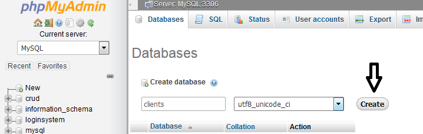
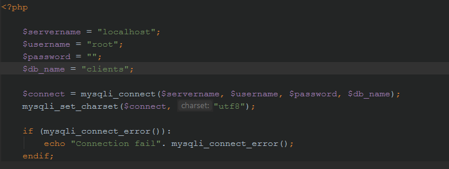
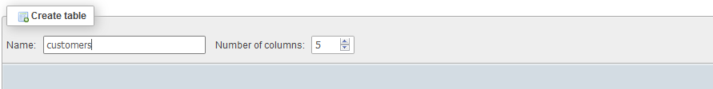
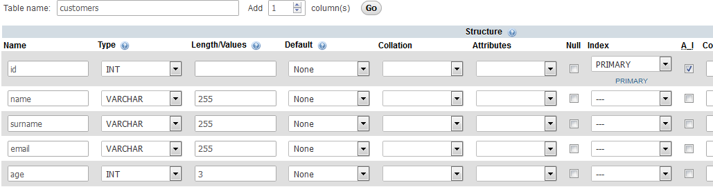
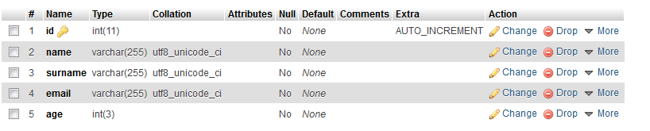
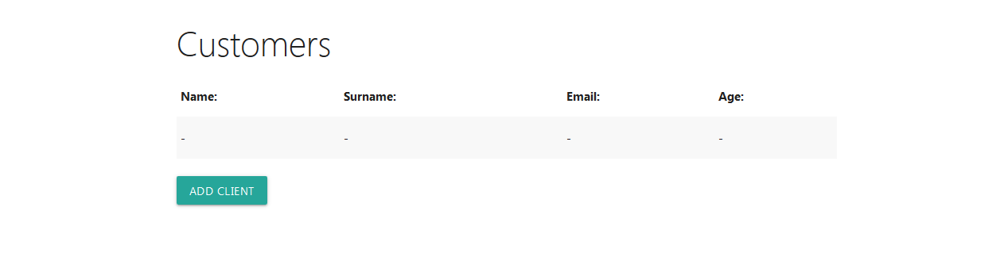
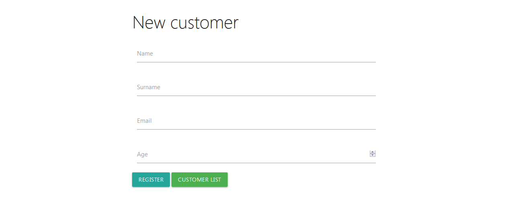
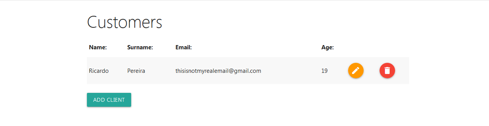
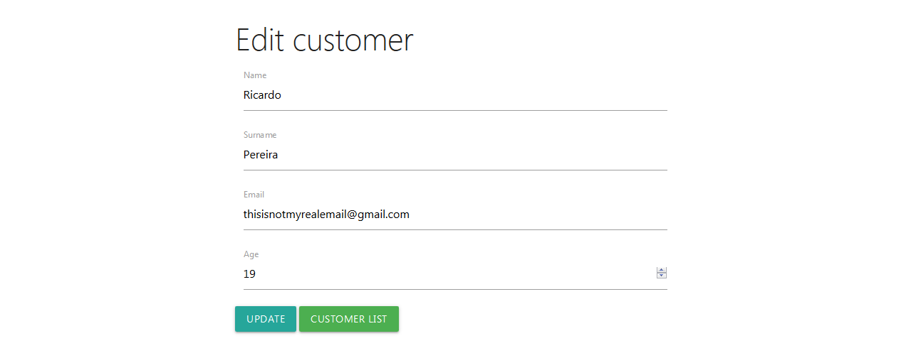
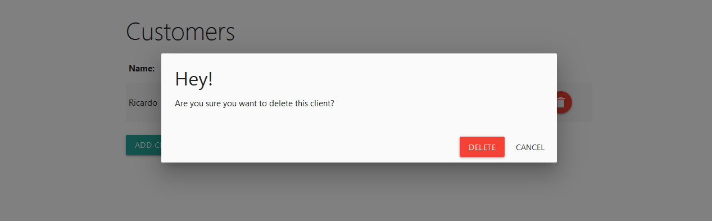

# Sistema de Cadastro

Customer Registration System PHP7-Procedural

<h3>Used:</h3>

<ul>

  <li>PHP 7</li>

  <li>HTML</li>

  <li>MATERIALIZECSS</li>
  
  <li>PHPMYADMIN</li>

</ul>

<h3>How to use:</h3>

1 - Create Database

If you use a different database name change $db_name on db_connect.php: 

2 - Create Table

3 - Create Columns

<h3>Screenshots:</h3>

Empty List:

Add customer:

Customers List:

Edit customer:

Delete customers:

